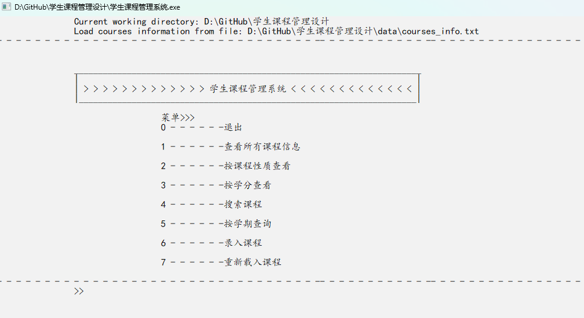
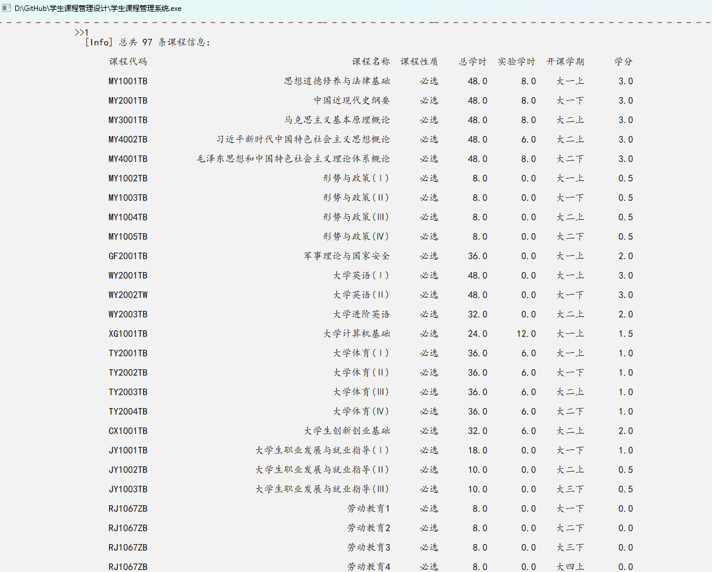
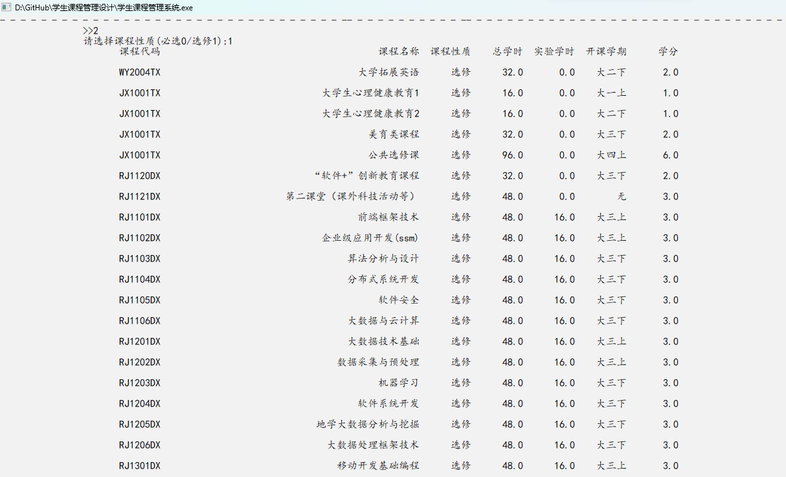
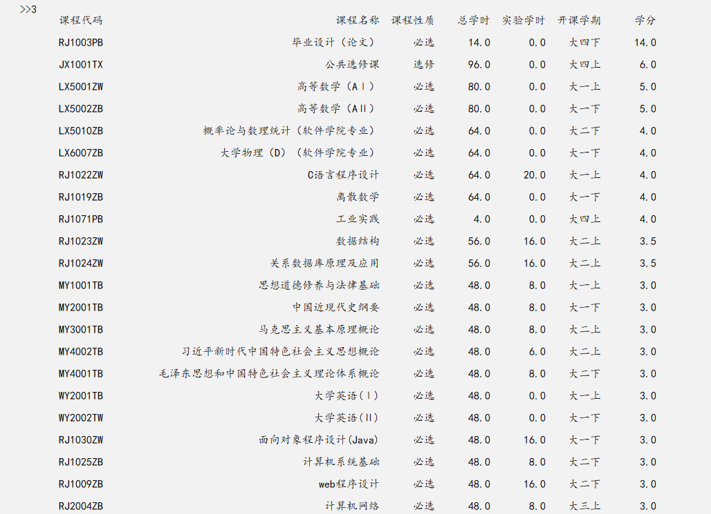
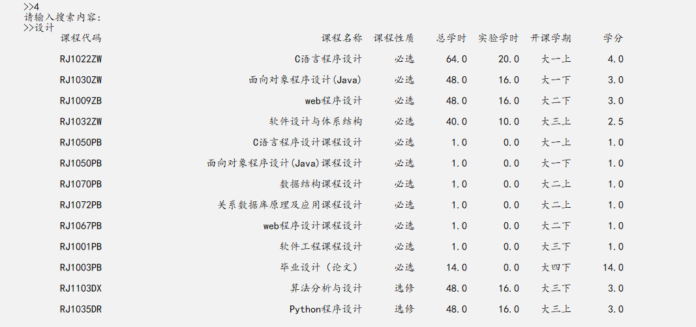
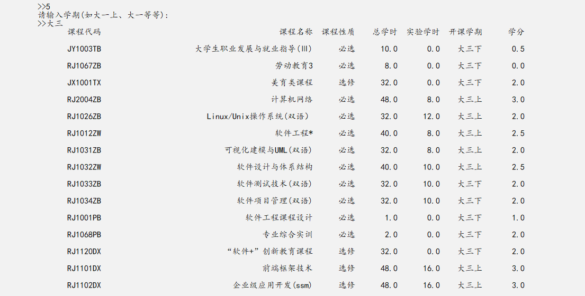
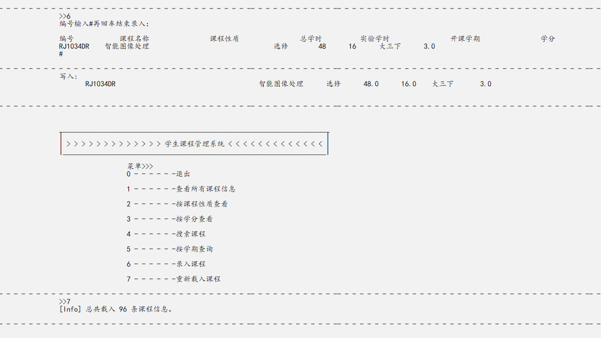
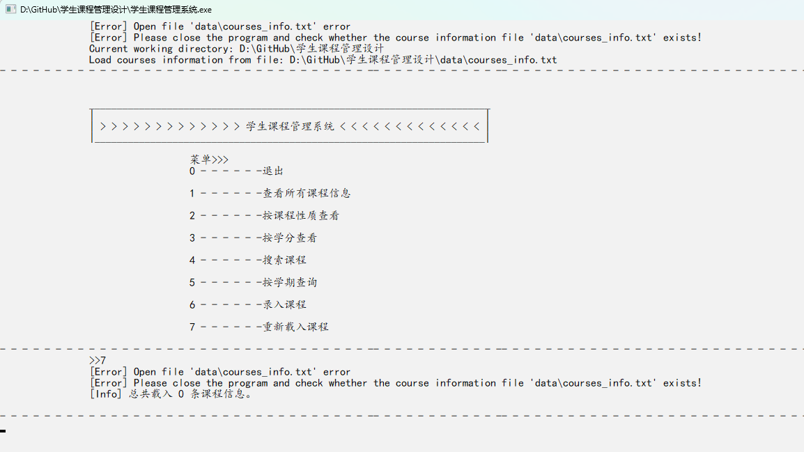

# 学生课程管理设计

## 仓库介绍

`data/` 中存放了 `course_info.txt` 作为程序的课程数据来源。课程数据来源于某大学的软件工程的培养方案。

`img/` 中存有程序运行的测试截图。

`src.cpp` 由 `Dev-C++` 编写，因此直接用 `VsCode` 等编辑器打开会出现乱码，可以通过 `.txt` 打开并复制源码则不会出现中文乱码。

## 功能实现

- [x] 查看课程列表
- [x] 根据课程性质(必选/选修)查看课程列表
- [x] 按学分按递减顺序查看课程列表
- [x] 搜索课程
- [x] 查看指定学期的课程列表
- [x] 录入课程
- [x] 重新载入课程

## 运行效果

## 未处理的bug

录入完成后，通过重新载入课程信息无法读取到最后一条课程信息。
